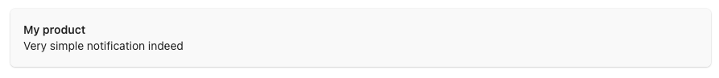
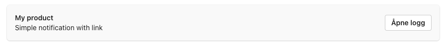
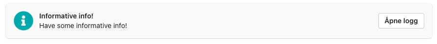
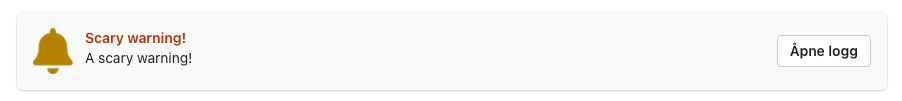
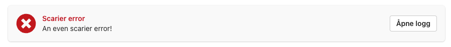

# notify-teams

## Development

[Javascript actions](https://docs.github.com/en/actions/creating-actions/creating-a-javascript-action)
must be self-contained. After making changes to `index.mjs`, run `npm build` to compile the script
and its dependencies into a single file, and commit the resulting file (together with sourcemaps).

## Usage

Complete workflow example:

```yaml
name: Check notification

on:
  push: {}
  release: {}

jobs:
  success:
    name: One with everything
    runs-on: ubuntu-22.04
    steps:
      - uses: biblioteksentralen/github-actions/notify-teams@main
        if: failure()
        with:
          webhooks-url: ${{ secrets.MS_TEAMS_WEBHOOK_URI}}
          github-token: ${{ secrets.GITHUB_TOKEN }}
          type: warning
          title: Produktnavn
          text: Noe feilet
```

* `github-token` is needed to fetch the URL to the current action run logs,
but can omitted if you don't want to link back to the action.
* `type` can be `info`, `warning` or `error`

### Examples

Simple notification without link back to the GitHub Actions run log:

```yaml
- uses: biblioteksentralen/github-actions/notify-teams@main
  with:
    webhooks-url: ${{ secrets.MS_TEAMS_WEBHOOK_URI_ALERT_CHANNEL}}
    title: My product
    text: Very simple notification indeed
```



Add `github-token` in order to link back to the GitHub Actions run log:

```yaml
- uses: biblioteksentralen/github-actions/notify-teams@main
  with:
    webhooks-url: ${{ secrets.MS_TEAMS_WEBHOOK_URI_ALERT_CHANNEL}}
    github-token: ${{ secrets.GITHUB_TOKEN }}
    title: My product
    text: Simple notification with link
```



Add `type` to style the notification as "info", "warning" or "error"

```yaml
- uses: biblioteksentralen/github-actions/notify-teams@main
  with:
    webhooks-url: ${{ secrets.MS_TEAMS_WEBHOOK_URI_ALERT_CHANNEL}}
    github-token: ${{ secrets.GITHUB_TOKEN }}
    type: info
    title: Informative info!
    text: Have some informative info!
```



```yaml
- uses: biblioteksentralen/github-actions/notify-teams@main
  with:
    webhooks-url: ${{ secrets.MS_TEAMS_WEBHOOK_URI_ALERT_CHANNEL}}
    github-token: ${{ secrets.GITHUB_TOKEN }}
    type: warning
    title: Scary warning!
    text: A scary warning!
```



```yaml
- uses: biblioteksentralen/github-actions/notify-teams@main
  with:
    webhooks-url: ${{ secrets.MS_TEAMS_WEBHOOK_URI_ALERT_CHANNEL}}
    github-token: ${{ secrets.GITHUB_TOKEN }}
    type: error
    title: Scarier error
    text: An even scarier error!
```



### Inputs

See [action.yml](action.yml) for more details.
